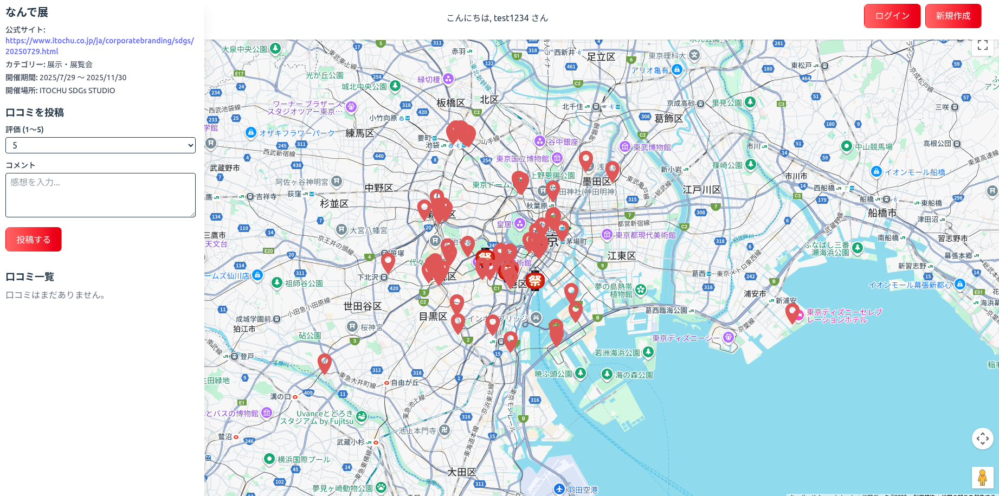
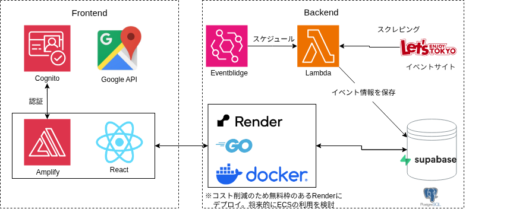
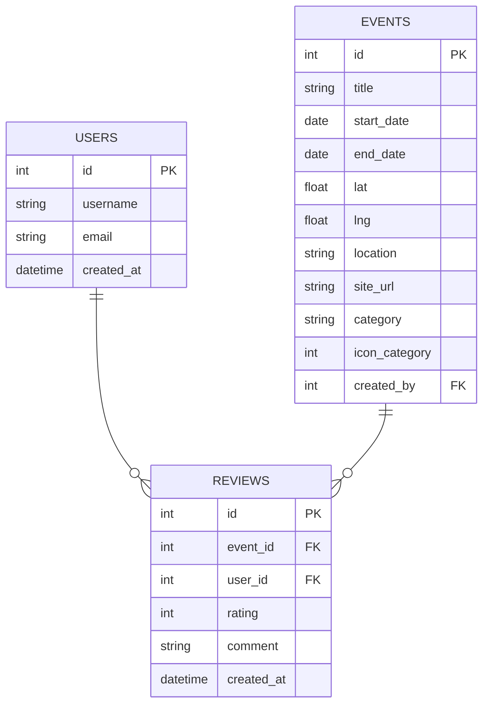

# MAPYOU
## デプロイURL
https://www.map-you.com/

## リポジトリ
- フロントエンド
  https://github.com/ysdko/mapyou-fe

- バックエンド
  https://github.com/ysdko/mapyou-bg

- スクレイピング
  https://github.com/ysdko/scraping-eventsite

## 目的
- 首都圏の遊び向けイベント情報を、ユーザーが地図上で直感的に探せるようにする。

- イベントの評価(5段階評価、口コミ)を見ることにより、イベントに行くかどうかの判断の参考にできるようにする

## アーキテクチャ図

## ER図

